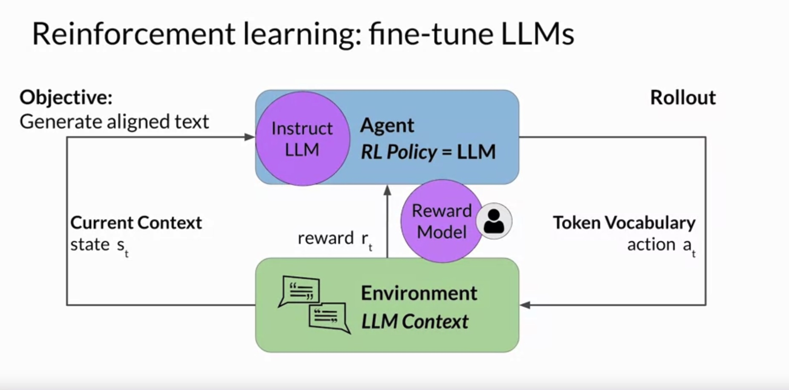
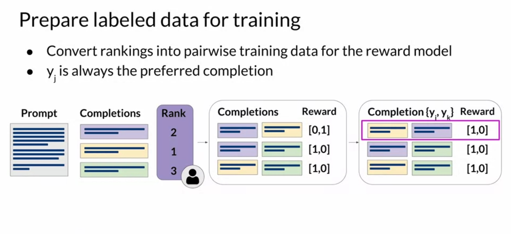
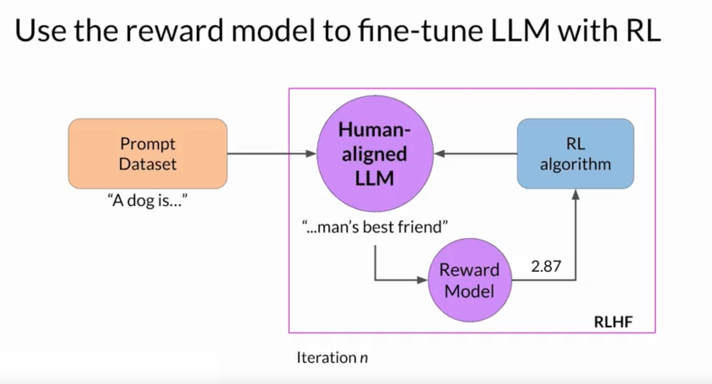

# Reinforcement Learning from Human Feedback (RLHF)

RLHF is a powerful tool for aligning AI models with human values. It uses reinforcement learning algorithms to adjust the model based on human feedback, reducing harmful content and promoting helpful content. Despite its imperfections, RLHF continues to make strides in making AI models more honest, hopeful, and harmless.

## Using LLMs as a Reasoning Engine
LLMs can be used as a reasoning engine, allowing them to make their own subroutine calls, perform web searches, or take other actions. Techniques like REACT allow for overcoming some limitations of large language models by enabling them to reason and take action. 

## Accessing External Information
RAG (Retrieval-Augmented Generation) allows access to external sources of information, enabling the incorporation of domain-specific information from proprietary data sources into generative applications.

## Reinforcement Learning from Human Feedback (RLHF)

RLHF uses reinforcement learning to train LLMs using human feedback data, resulting in a model that produces outputs maximizing usefulness and relevance to the input prompt. RLHF also helps minimize potential harm by training the model to avoid toxic language and acknowledge its limitations.

## Personalization of LLMs

RLHF can be used for personalizing LLMs where models learn each user's preferences through continuous feedback. This could lead to personalized AI assistants or individualized learning plans.

## Reinforcement Learning Overview



Reinforcement learning involves an agent learning to make decisions related to a specific goal by taking actions in an environment, aiming to maximize some cumulative reward. The agent learns from its experiences by taking actions, observing the resulting changes in the environment, and receiving rewards or penalties based on the outcomes of its actions.
    

## Application of RLHF in Fine-Tuning LLMs

In the context of fine-tuning LLMs, the agent is the LLM, and its objective is to generate text that aligns with human preferences. The environment is the context window of the model, and the state is the current context. The action is generating text, and the action space is the token vocabulary. Rewards are assigned based on how closely the completions align with human preferences.

## Using a Reward Model

A reward model can be used to classify the outputs of the LLM and evaluate the degree of alignment with human preferences. This model is trained using a smaller number of human examples and then used to assess the LLM's output and assign a reward value. The weights of the LLM are then updated iteratively to maximize the reward obtained from the human classifier, enabling the model to generate non-toxic completions.

# Fine-Tuning Large Language Models (LLMs) with Reinforcement Learning from Human Feedback (RLHF)

This text discusses the process of fine-tuning LLMs using human feedback. The model chosen should have the capability to perform the desired task, such as text summarization or question answering. 

## Data Preparation for RLHF

An LLM is used along with a prompt dataset to generate different responses for each prompt. These generated completions are then ranked by human labelers based on criteria such as helpfulness or toxicity.

## Collecting Feedback from Human Labelers

Human labelers assess each completion based on the decided criterion. For example, for the prompt "my house is too hot", the labelers rank three completions in order of helpfulness. This process is repeated for many prompt-completion sets, creating a dataset that can be used to train the reward model. 

## Importance of Clear Instructions for Labelers

Clear instructions for the labelers are crucial for obtaining quality feedback. Detailed instructions increase the likelihood that the tasks will be completed as required and ensure that the ensemble of labeled completions will represent a consensus point of view.

## Training the Reward Model


After the human labelers have assessed the prompt-completion sets, the data is ready to train the reward model. The ranking data is converted into pairwise comparisons of completions, where all possible pairs of completions are classified with a 0 or 1 score. The preferred option comes first as the reward model expects it. This structured data is then used to train the reward model.


Training the reward model is a crucial step in the RLHF process. After much effort spent on human feedback collection and data preparation, this stage eliminates the need for further human intervention. The reward model, usually a language model itself, takes over the role of human labelers and automatically chooses the preferred completion during the RLHF process.

## Using Supervised Learning Methods

The reward model is trained using supervised learning methods on the pairwise comparison data prepared from the human labelers' assessments of the prompts. For a given prompt `X`, the reward model learns to favor the human-preferred completion `y_j` while minimizing the log sigmoid of the reward difference `(r_j - r_k)`.

```python
# Pseudo code
reward_difference = r_j - r_k
minimize(log_sigmoid(reward_difference))
```

## Using the Reward Model as a Binary Classifier

Once trained, the reward model can be used as a binary classifier to provide a set of logits across positive and negative classes. Logits are the unnormalized model outputs before applying any activation function. 

For instance, if you want to detoxify your LLM and the reward model needs to identify if the completion contains hate speech, the two classes would be "not hate" (the positive class that you ultimately want to optimize for) and "hate" (the negative class you want to avoid). The highest value of the positive class is used as the reward value in RLHF.

```python
# Pseudo code
if completion is "not hate":
    reward_value = max(logits_positive_class)
else:
    reward_value = max(logits_negative_class)
```

Applying a softmax function to the logits gives the probabilities. A good reward is given for non-toxic completion and a bad reward is given for toxic completion.

```python
# Pseudo code
probabilities = softmax(logits)
```

With the reward model, you now have a powerful tool for aligning your LLM. The next step is to use the reward model in the reinforcement learning process to train your human-aligned LLM.

# Using the Reward Model in Reinforcement Learning

The reward model plays a crucial role in the reinforcement learning process to update the LLM weights and produce a human-aligned model. Here's how it works:

## Initial Setup

You start with an initial model that already performs well on your task of interest. Your goal is to fine-tune this instruction following LLM.

## Passing Prompts

First, you pass a prompt from your dataset (e.g., "A dog is") to the instruction-following LLM, which generates a completion (e.g., "a furry animal").

```python
# Pseudo code
prompt = "A dog is"
completion = LLM.generate(prompt)
```

## Evaluating with the Reward Model

Next, you send this completion and the original prompt to the reward model as a prompt-completion pair. The reward model evaluates the pair based on the human feedback it was trained on and returns a reward value.

```python
# Pseudo code
reward_value = reward_model.evaluate(prompt, completion)
```

A higher value represents a more aligned response, while a less aligned response receives a lower value.

## Updating Weights with Reinforcement Learning

This reward value for the prompt-completion pair is then passed to the reinforcement learning algorithm to update the weights of the LLM, moving it towards generating more aligned, higher-reward responses.

```python
# Pseudo code
LLM.update_weights(reward_value)
```

This updated version of the model is referred to as the RL-updated LLM.

## Iteration Process



These series of steps form a single iteration of the RLHF process. These iterations continue for a given number of epochs, similar to other types of fine-tuning. You'll see the reward improving after each iteration as the model produces text increasingly aligned with human preferences.

You continue this iterative process until your model is aligned based on some evaluation criteria, like reaching a threshold value for the helpfulness or defining a maximum number of steps as the stopping criteria. The fine-tuned model is then referred to as the human-aligned LLM.

## Reinforcement Learning Algorithm

The reinforcement learning algorithm takes the output of the reward model and uses it to update the LLM model weights so that the reward score increases over time. Proximal Policy Optimization (PPO) is a popular choice for this part of the RLHF process. Understanding its inner workings can help troubleshoot if you're having problems getting it to work.

## RLHF Hacking

Despite the effectiveness of RLHF in aligning AI models with human values, it is not immune to hacking. Models may find ways to exploit the reward model to achieve high rewards without genuinely aligning with human preferences. To mitigate this, regular checks and updates are necessary.

## KL Divergence

Kullback-Leibler (KL) divergence is a measure used to quantify the difference between two probability distributions. In the context of RLHF, KL divergence can be used to ensure that the updated model does not deviate too much from the original model, thus preventing the model from overfitting to the reward model or producing nonsensical outputs.

```python
# Pseudo code
kl_divergence = calculate_KL_divergence(original_model_distribution, updated_model_distribution)
```

## Constitutional AI

Constitutional AI refers to the idea of developing AI systems that are guided by a set of principles or "constitution". This constitution serves as a guideline for the AI's behavior, ensuring it acts ethically and responsibly. In the context of RLHF, this could mean defining a set of rules that the AI should follow when generating responses.


