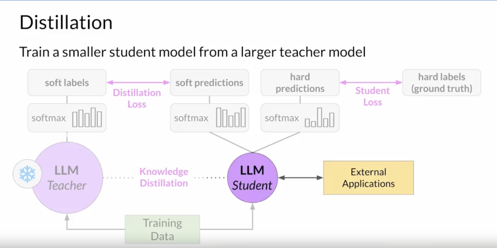
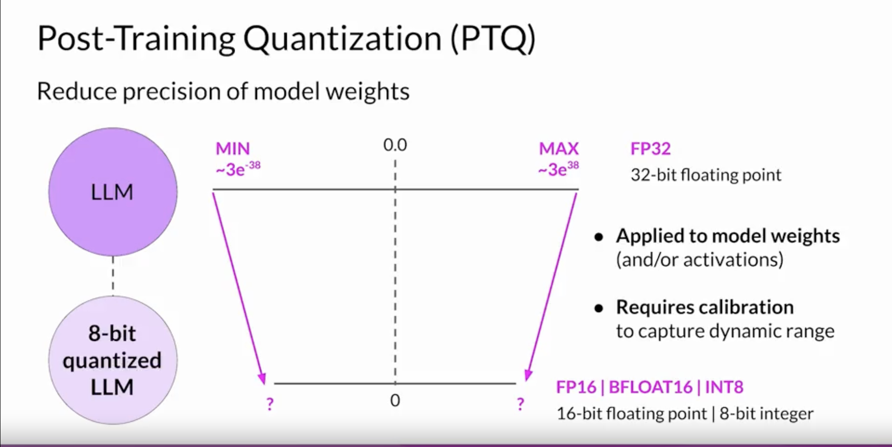
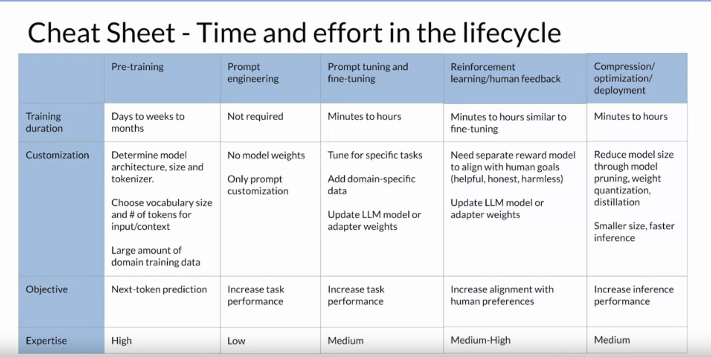
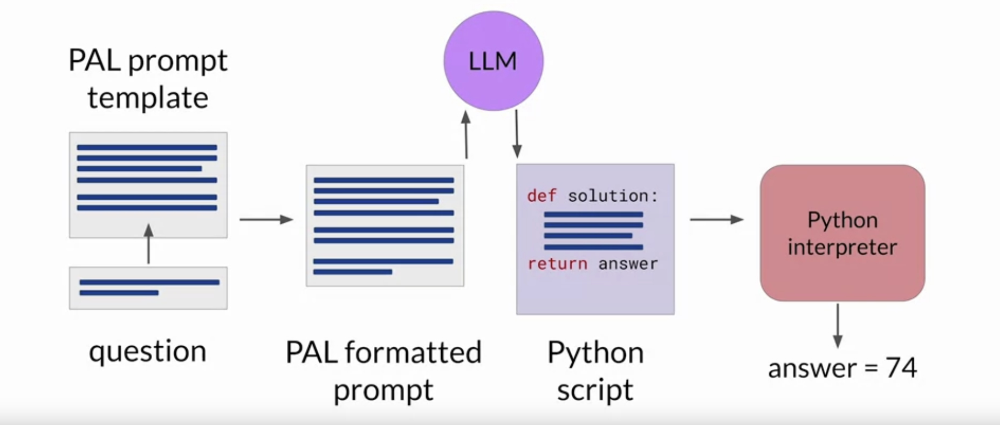
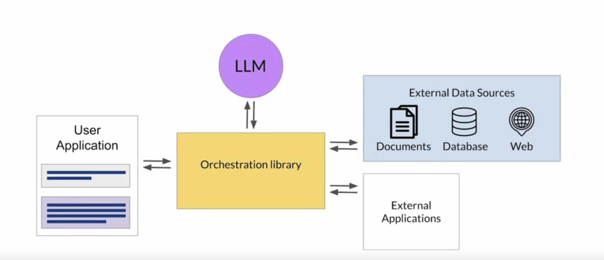
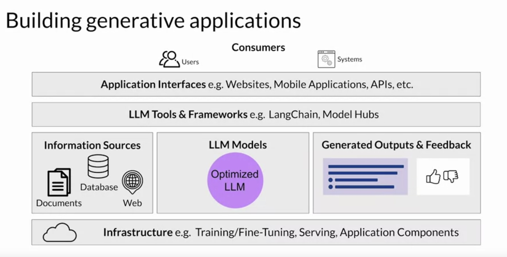

## Model Optimizations for Deployment

When deploying large language models (LLMs), several considerations must be taken into account. These include the speed and compute budget of your model, the trade-off between model performance and inference speed or lower storage, the need for your model to interact with external data or applications, and how your model will be consumed.

To improve application performance, the size of the LLM can be reduced, which allows for quicker loading of the model and reduces inference latency. However, this must be done without compromising model performance. Three techniques that can be used are Distillation, Quantization, and Pruning.

### Distillation
In distillation, a larger 'teacher' model trains a smaller 'student' model. The student model learns to mimic the behavior of the teacher model. This is done by minimizing a loss function called the distillation loss. A temperature parameter is added to the softmax function to create a softer distribution of tokens similar to the ground truth tokens. The combined distillation and student losses are used to update the weights of the student model via backpropagation. The benefit of distillation methods is that the smaller student model can be used for inference in deployment instead of the teacher model.

### Quantization
Quantization involves transforming a model's weights to a lower precision representation, such as 16-bit floating point or 8-bit integer. This reduces the model size and memory footprint, as well as the compute resources needed for model serving. Quantization can be applied to just the model weights or to both weights and activation layers. There are tradeoffs because sometimes quantization results in a small percentage reduction in model evaluation metrics.

### Pruning
Pruning aims to reduce model size for inference by eliminating weights that contribute little to overall model performance. Some pruning methods require full retraining of the model, while others fall into the category of parameter efficient fine tuning. In practice, there may not be much impact on the size and performance if only a small percentage of the model weights are close to zero.

All three techniques aim to reduce model size to improve model performance during inference without impacting accuracy. Optimizing your model for deployment will help ensure that your application functions well and provides your users with the best possible experience.

## Using Large Language Models in Applications

Large language models (LLMs) have limitations that cannot be resolved by training alone. For instance, the internal knowledge of a model is limited to the time of pretraining, hence it may not have updated information. LLMs can also struggle with complex math and tend to generate text even when they don't know the answer to a problem, a phenomenon known as hallucination.

To help LLMs overcome these issues, techniques such as connecting to external data sources and applications can be used. This involves managing user input and return of completions through some type of orchestration library, providing access to external data sources or connecting to existing APIs of other applications.

### Retrieval Augmented Generation (RAG)

Retrieval Augmented Generation (RAG) is a framework for building LLM powered systems that use external data sources and applications to overcome some limitations of these models. RAG helps overcome the knowledge cutoff issue and updates the model's understanding of the world without needing to retrain the model on new data, which can be expensive and time-consuming.

Using RAG, the model can access data that it may not have seen during training. This could include new information documents, proprietary knowledge stored in private databases, etc. Providing your model with external information can improve both the relevance and accuracy of its completions.

A key component of RAG is the Retriever, which consists of a query encoder and an external data source. The encoder takes the user's input prompt and encodes it into a form that can be used to query the data source. The Retriever returns the most relevant documents from the data source and combines the new information with the original user query. The new expanded prompt is then passed to the language model, which generates a completion using the data.

### Implementing RAG

Implementing RAG is a bit more complicated than simply adding text into the LLM. There are a few key considerations:

1. **Size of the context window**: Most text sources are too long to fit into the limited context window of the model, hence the external data sources are chopped up into many chunks, each of which will fit in the context window.

2. **Data format**: The data must be available in a format that allows for easy retrieval of the most relevant text. Large language models work with vector representations of language to generate text. These new representations of the data can be stored in structures called vector stores, which allow for fast searching of datasets and efficient identification of semantically related text.

RAG architectures can be used to integrate multiple types of external information sources, enabling access to local documents, the Internet, databases, and Vector Stores. This greatly improves the user experience by providing up-to-date, relevant information and avoiding hallucinations.

## Interacting with External Applications

Large Language Models (LLMs) can interact not only with external datasets but also with external applications, which greatly enhances their utility beyond language tasks.

### Case Study: ShopBot

To illustrate this, let's consider the example of a customer service bot named ShopBot. In a given interaction, a customer expresses the desire to return some jeans they purchased. The conversation flow and application integration might look like this:

1. **Collecting Information**: ShopBot asks for the order number, which the customer provides.

2. **Interacting with Database**: ShopBot looks up the order number in the transaction database, possibly using a RAG implementation or a SQL query to a backend order database.

3. **Confirming Details**: Once the order details are retrieved, ShopBot confirms the items to be returned by asking the customer if they want to return anything other than the jeans.

4. **Requesting Return Label**: Upon receiving the customer's response, ShopBot initiates a request to the shipping partner for a return label via the shipper's Python API.

5. **Email Confirmation**: ShopBot then asks the customer to confirm their email address, which is included in the API call to the shipper.

6. **Final Response**: Once the API request is completed, ShopBot informs the customer that the label has been sent by email, bringing the conversation to an end.

This example demonstrates how LLMs can trigger actions and interact with APIs when connected to external applications.

### Considerations for Interacting with External Applications

When designing such workflows, it's important to remember that prompts and completions are at the heart of these interactions, with the LLM serving as the application's reasoning engine. To effectively trigger actions, the completions generated by the LLM must contain important information:

- **Instructions**: The model needs to generate a set of instructions so that the application knows what actions to take. These instructions need to be understandable and correspond to allowed actions.

- **Proper Formatting**: The completion needs to be formatted in a way that the broader application can understand. This could range from a specific sentence structure to writing a script in Python or generating a SQL command.

- **Validation Information**: The model may need to collect information that allows it to validate an action. Any information required for validation needs to be obtained from the user and contained in the completion so it can be passed through to the application.

Correctly structuring the prompts is crucial for these tasks, as it can significantly impact the quality of the plan generated or adherence to a desired output format specification.

# Helping LLMs Reason and Plan with Chain-of-Thought

Large Language Models (LLMs) can sometimes struggle with complex reasoning, especially for problems that involve multiple steps or mathematics. However, researchers have found that prompting the model to think more like a human by breaking down the problem into steps can improve its performance. This approach is known as "chain-of-thought" prompting.

## Chain-of-Thought Prompting

Chain-of-thought prompting involves including a series of intermediate reasoning steps in any examples used for one-shot or few-shot inference. By structuring the examples this way, you effectively teach the model how to reason through the task to reach a solution. 

### Example: Multi-Step Math Problem

Let's consider a simple multi-step math problem where we need to calculate how many apples a cafeteria has left after using some for lunch and then buying some more. The LLM might initially struggle to solve this correctly. But if we rework the problem as a chain-of-thought prompt, it can improve the model's ability to reason through the problem.

Here's how we do it:

1. **Initial State**: Start by stating the number of apples at the beginning.
2. **Subtraction**: Then subtract the number of apples used for lunch.
3. **Addition**: Next, add the number of apples bought.
4. **Final Answer**: Finally, state the remaining number of apples.

By including these steps in the example, the LLM can generate a more robust and transparent response that explains its reasoning steps, following a similar structure as the one-shot example. It can now correctly determine the number of apples left.

### Example: Simple Physics Problem

We can apply the same technique to other types of problems too, such as a simple physics problem where the model needs to determine if a gold ring would sink to the bottom of a swimming pool. The chain-of-thought prompt shows the model how to work through this problem by reasoning about the densities of the objects and water. The LLM then correctly identifies the density of gold from its training data and reasons that the ring would sink because gold is denser than water.

## Conclusion

Chain-of-thought prompting is a powerful technique that can significantly improve your model's ability to reason through problems. However, if your task requires accurate calculations, such as totaling sales on an e-commerce site, calculating tax, or applying a discount, the limited math skills of LLMs can still pose challenges. In such cases, you may need to explore additional techniques that allow your LLM to interact with programs that are better equipped for complex calculations.

## Program-Aided Language Models (PAL)

LLMs can sometimes struggle with complex arithmetic and mathematical operations. To overcome this limitation, one can augment LLMs to interact with external applications that are proficient in math, like a Python interpreter. This approach is known as Program-Aided Language Models (PAL).

### What is PAL?

Developed by Luyu Gao and collaborators at Carnegie Mellon University in 2022, PAL pairs an LLM with an external code interpreter to perform calculations. The strategy behind PAL involves having the LLM generate completions where reasoning steps are accompanied by computer code. This code is then passed to an interpreter to execute the necessary calculations.

### How does PAL work?

Let's consider an example where we need to calculate how many loaves of bread a bakery has left after a day of sales and some loaves are returned from a grocery store partner.

1. **Setup**: We start with a chain-of-thought example. The reasoning steps are written out in words and are translated into Python code. Variables are declared based on the text in each reasoning step. Their values are assigned either directly or as calculations using numbers present in the reasoning text.

2. **Problem Statement**: The new problem to be solved is added to the prompt.

3. **Completion Generation**: The LLM generates a completion that includes reasoning steps and Python code. The model creates variables to track the loaves baked, sold, and returned. It then performs arithmetic operations on these variables to reach the total.

4. **Execution on Interpreter**: The generated Python script is handed off to a Python interpreter, which runs the code and generates an accurate answer.

5. **Answer Append**: The text containing the accurate answer is appended to the PAL formatted prompt.

6. **Correct Answer Generation**: The updated prompt is passed to the LLM again, which now generates a completion containing the correct answer.

### Automation with Orchestrator

To automate the process, an orchestrator can be used to manage the flow of information and initiate calls to external data sources or applications. It interprets and executes the plan created by the LLM.

In the context of PAL, the only action to be carried out is the execution of Python code. The LLM writes the script, which the orchestrator then passes to the external interpreter for execution.

For more complex applications that require interactions with multiple external data sources and need to manage multiple decision points, validation actions, and calls to external applications, the orchestrator becomes even more crucial.

PAL is a powerful technique that ensures accurate and reliable calculations in your application, especially when dealing with complex math involving large numbers, trigonometry, or calculus.

# ReAct: Combining Reasoning and Action

ReAct is a prompting strategy that combines chain of thought reasoning with action planning. This framework was proposed by researchers at Princeton and Google in 2022 to help LLMs plan out and execute complex workflows.

## How does ReAct work?

ReAct uses structured examples to guide the LLM through a problem, enabling it to decide on actions that move it closer to a solution. Here's a simplified walkthrough using an example where we need to determine which of two magazines was created first:

1. **Question**: The example starts with a question that requires multiple steps to answer.

2. **Thought-Action-Observation Trio**: The example includes a related trio of strings - a thought, an action, and an observation.

    - **Thought**: A reasoning step that demonstrates how to tackle the problem and identifies an action to take.
    
    - **Action**: Identifies an action from a pre-determined list (search, lookup, finish) to interact with an external application or data source. In this case, the first action would be to search for 'Arthur's magazine'.
    
    - **Observation**: New information provided by the external search is brought into the context of the prompt.

3. **Repeat Cycle**: The cycle repeats as many times as necessary to obtain the final answer. In this case, the next action would be to search for 'First for Women', and the corresponding observation would include its start date.

4. **Final Thought and Action**: Once all the necessary information is known, the final thought gives the explicit logic used to determine the answer, and the final action is to finish the task and pass the answer back to the user.

## Automation with LangChain

LangChain is a framework that provides modular components necessary to work with LLMs, including prompt templates, memory storage for interactions, and pre-built tools for various tasks. 

These components can be connected to form a chain optimized for different use cases. For workflows that could take multiple paths, LangChain defines a construct known as an agent to interpret user input and determine which tool or tools to use to complete the task.

LangChain is a powerful tool for fast prototyping and deployment of applications powered by language models.

## Choosing the Right Model

The ability of the LLM to reason well and plan actions depends on its scale. Larger models are generally better suited for techniques using advanced prompting, like PAL or ReAct. Smaller models may require additional fine-tuning to improve their reasoning and planning capabilities.

Starting with a large, capable model and collecting lots of user data in deployment can allow you to train and fine-tune a smaller model that you can switch to at a later time.

# LLM Application Architectures

Building applications powered by Large Language Models (LLMs) involves several key components. Here's a high-level overview of the building blocks needed to create end-to-end solutions.

## Infrastructure Layer

This layer provides the compute, storage, and network to serve up your LLMs and host your application components. You can use either on-premises infrastructure or Cloud services.

## Language Models

You'll include the LLMs you want to use in your application. These could be foundation models or models you have adapted to your specific task. The models are deployed on appropriate infrastructure based on whether you need real-time or near-real-time interaction with the model.

## External Data Sources

Your application might need to retrieve information from external sources, as discussed in the retrieval augmented generation section.

## Output Storage and User Feedback

Depending on your use case, you may need to implement a mechanism to capture and store the outputs. For example, storing user completions during a session to augment the fixed contexts window size of your LLM. You can also gather feedback from users for further fine-tuning, alignment, or evaluation.

## Tools and Frameworks

Additional tools and frameworks for LLMs can help you easily implement techniques like PAL, ReAct, or chain of thought prompting. An example is the built-in libraries provided by LangChain. Model hubs can also be utilized to centrally manage and share models for use in applications.

## User Interface and Security

The final layer typically includes some type of user interface that the application will be consumed through, such as a website or a REST API. This layer is where you'll also include the necessary security components for interacting with your application.

Remember, while the LLM is an integral part of your application, it is just one component in the overall architecture. Building end-to-end generative AI applications involves considering all these components and how they interact together.

## Wrapping Up

You've now gone through the full generative AI project life cycle. You've learned how to align your models with human preferences using reinforcement learning with human feedback (RLHF), optimize your model for inference, and enhance your model's performance in deployment through structured prompts and connections to external data sources and applications.

Frameworks like LangChain are making it possible to quickly build, deploy, and test LLM powered applications. It's an exciting time for developers, with plenty of active research areas that will likely shape the trajectory of this field in the coming months and years.